# Image-Pixel Based Watermarking Pipeline

This diagram illustrates the StyleGAN watermarking pipeline when using image pixels for key generation.

```mermaid
flowchart LR
    %% Starting with random latent vectors
    Latent["Random
    Latent Vectors"]
    
    %% Models stacked vertically
    subgraph Models["StyleGAN Models"]
        direction TB
        StyleGAN["Original StyleGAN
        (Frozen)"]
        Watermarked["Watermarked StyleGAN
        (Trainable)"]
    end
    
    %% Images generated - second row
    ImageOrig["Original
    Image"]
    
    ImageWater["Watermarked
    Image"]
    
    %% Configuration elements - positioned to avoid crossings
    Config["Configuration
    • Pixel Count: 32
    • Pixel Selection Seed: 42
    • Key Mapper Seed: 2025"]
    
    PixelIndices["Fixed Pixel
    Indices"]
    
    %% Pixel extraction - third row
    PixelValues["Selected
    Pixel Values"]
    
    %% Key mapping and decoding in parallel
    subgraph Processors["Processing"]
        direction TB
        Mapper["Key Mapper"]
        Decoder["Decoder"]
    end
    
    %% Keys - aligned vertically
    subgraph Keys["Generated Keys"]
        direction TB
        TrueKey["True Key"]
        PredKey["Predicted Key"]
    end
    
    %% Loss computation - final row
    Loss["Loss Computation
    • BCE Loss (Key Accuracy)
    • LPIPS Loss (Image Quality)"]
    
    %% Connections organized in layers to avoid crossings
    %% First layer - latent to models
    Latent --> Models
    
    %% Second layer - models to images
    StyleGAN --> ImageOrig
    Watermarked --> ImageWater
    
    %% Configuration to indices
    Config --> PixelIndices
    Config --> Mapper
    
    %% Third layer - image to pixel values
    ImageWater --> PixelValues
    PixelIndices -.-> PixelValues
    
    %% Fourth layer - pixel values to mapper and image to decoder
    PixelValues --> Mapper
    ImageWater --> Decoder
    
    %% Fifth layer - mapper and decoder to keys
    Mapper --> TrueKey
    Decoder --> PredKey
    
    %% Final layer - everything to loss
    Keys --> Loss
    ImageWater --> Loss
    ImageOrig --> Loss
    
    %% Update connections
    Loss --> |Update| Watermarked
    Loss --> |Update| Decoder
    
    %% Styling for better visibility in presentations
    classDef config fill:#fff2cc,stroke:#d6b656,stroke-width:2px
    classDef model fill:#d5e8d4,stroke:#82b366,stroke-width:2px
    classDef image fill:#dae8fc,stroke:#6c8ebf,stroke-width:2px
    classDef process fill:#f8cecc,stroke:#b85450,stroke-width:2px
    classDef data fill:#e1d5e7,stroke:#9673a6,stroke-width:2px
    classDef subgroupStyle fill:#f9f9f9,stroke:#999,stroke-width:1px
    
    %% Apply styles
    class Config config
    class StyleGAN,Watermarked model
    class Models,Processors,Keys subgroupStyle
    class ImageWater,ImageOrig image
    class PixelIndices,PixelValues,TrueKey,PredKey data
    class Latent,Loss,Mapper,Decoder process
    
    %% Adjust node sizes
    linkStyle default stroke-width:2px
```

## Image-Pixel Watermarking Process Flow

1. **Start with Random Latent Vectors**
   - Generate random latent vectors as input for both models
   - These vectors serve as the "seed" for image generation

2. **Generate Images using Both Models**
   - Original StyleGAN (frozen) produces unwatermarked reference images
   - Watermarked StyleGAN (trainable) produces images with embedded watermarks

3. **Extract and Process Watermark**
   - Extract specific pixel values from predetermined locations in watermarked image
   - Map these pixel values to a true binary key using the Key Mapper
   - Attempt to decode the watermark from the image using the Decoder

4. **Optimize the System**
   - Calculate BCE loss between true and predicted keys (watermark accuracy)
   - Calculate LPIPS loss between original and watermarked images (visual quality)
   - Update the watermarked GAN and decoder to improve both metrics

The model learns to subtly modify pixel values at specific locations to embed a recoverable watermark while maintaining visual quality.

## Configuration Components

- **Pixel Count** (32): Number of specific pixels sampled from each generated image
- **Pixel Selection Seed** (42): Controls which specific pixels are selected consistently
- **Key Mapper Seed** (2025): Ensures consistent initialization of the Key Mapper network

## Simplified Image-Pixel Watermarking Process

1. **Configuration & Setup**
   - Define pixel count and random seeds
   - Generate fixed set of pixel indices
   - Initialize models (original StyleGAN, watermarked StyleGAN, Key Mapper, Decoder)

2. **Training Loop**
   - Generate images from random latent vectors using both models
   - Extract specific pixel values from predetermined locations in watermarked image
   - Map these values to a binary key through the Key Mapper
   - Attempt to extract the watermark from the image using the Decoder
   - Calculate losses for watermark accuracy (BCE) and image quality (LPIPS)
   - Update watermarked model and decoder to improve performance

The model learns to subtly modify pixel values at specific locations to embed a recoverable watermark while maintaining visual quality.

## How the Image-Pixel Watermarking Pipeline Works

### Setup Phase
1. **Configuration**: 
   - Set number of pixels to sample (default: 32)
   - Define seeds for reproducibility
   
2. **Initialization**:
   - Load pretrained StyleGAN model
   - Create trainable watermarked model
   - Generate fixed pixel indices that will be sampled from every image
   - Initialize Key Mapper with its own seed

### Training Pipeline
1. **Image Generation**:
   - Sample random latent vectors
   - Generate pairs of original and watermarked images
   
2. **Watermark Process**:
   - Extract specific pixel values from predetermined locations
   - Map these values to a binary watermark key
   - Attempt to decode the watermark from the image
   
3. **Optimization**:
   - Calculate BCE loss for watermark accuracy
   - Calculate LPIPS loss for image quality
   - Update the watermarked GAN and decoder to improve both metrics

The trainable model learns to embed recoverable watermarks while maintaining visual quality. The system uses fixed pixel positions but learns to subtly modify their values to encode the watermark information.

## Model Roles

1. **Original StyleGAN (Frozen)**: Pre-trained StyleGAN model used as reference for image fidelity
2. **Watermarked StyleGAN (Trainable)**: Model being trained to generate watermarked images
3. **Key Mapper**: Maps selected pixel values to binary watermark keys (uses its own random seed)
4. **Decoder**: Extracts watermark keys from generated images

## Parameters and Seeds

The pipeline uses several configuration parameters:

1. **image_pixel_count** (default: 32): The number of pixels to select from generated images
2. **Pixel Selection Seed** (default: 42): Used to generate the fixed set of specific pixel indices
3. **Key Mapper Seed** (default: 2025): Used to initialize the Key Mapper

## Key Processes

### Initialization
- The model initialization process includes generating a fixed set of pixel indices
- The number of pixels is determined by the `image_pixel_count` parameter
- The specific indices chosen are determined by the pixel selection seed
- The Key Mapper is initialized based on:
  - The `image_pixel_count` parameter (determines input dimension)
  - Its own seed for reproducible initialization

### Training Workflow
1. Random latent vectors are sampled and fed to both GAN models
2. The watermarked model generates images with embedded watermarks
3. Specific pixel values are extracted from predetermined locations
4. These pixel values are mapped to a binary key through the Key Mapper
5. The Decoder attempts to extract the same key from the watermarked image
6. The system optimizes for:
   - Accurate key extraction (BCE loss)
   - Visual similarity to unwatermarked images (LPIPS loss)

### Pixel Extraction
- Images are flattened to a 1D array
- Values at the predetermined indices are selected
- These values serve as the signature that maps to the watermark

The training process iteratively improves the watermarked model's ability to embed recoverable watermarks while maintaining image quality. 