# Key Mapper Process

```mermaid
flowchart LR
    classDef vector fill:#f3e5f5,stroke:#7b1fa2
    classDef mapper fill:#fff8e1,stroke:#f57f17
    classDef binary fill:#e8f5e9,stroke:#2e7d32
    
    wp[w_partial<br>&#40;32 elements&#41;]:::vector --> km[Key Mapper<br>Neural Network]:::mapper
    km --> key[Binary Key<br>&#40;8 bits&#41;]:::binary
    
    subgraph wp_detail[w_partial Vector]
        wpv["[0.42, -1.2, 0.85, ..., -0.31]"]:::vector
    end
    
    subgraph key_detail[Binary Key]
        keyv["[1, 0, 1, 0, 0, 1, 1, 0]"]:::binary
    end
    
    wp_detail -.-> wp
    key -.-> key_detail
    
    note[Key Mapper is initialized with a<br>fixed random seed for reproducibility]
    
    note -.-> km
```

## Description

This diagram shows how the Key Mapper transforms the w_partial vector into a binary key:

1. **Input**
   - w_partial vector with 32 elements
   - Each element is a floating-point number from the selected indices
   - Example values shown: [0.42, -1.2, 0.85, ..., -0.31]

2. **Key Mapper**
   - Neural network that maps 32-dimensional input to binary output
   - Initialized with a fixed random seed for reproducibility
   - Not trained during the watermarking process

3. **Output**
   - Binary key of configurable length (default: 4 bits in code)
   - Example shown: [1, 0, 1, 0, 0, 1, 1, 0]
   - Each bit represents part of the watermark

4. **Properties**
   - Deterministic mapping (same input always produces same output)
   - Fixed during training (not updated)
   - Used to generate the "true key" for training the decoder 