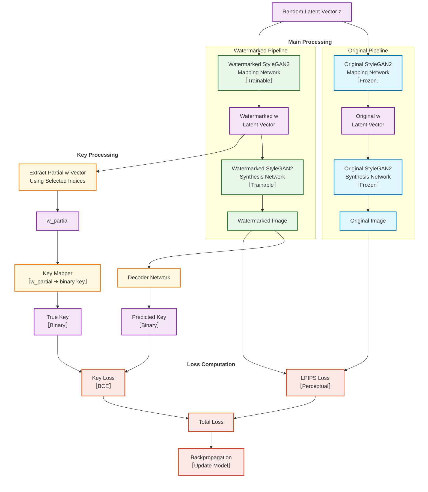

# StyleGAN Watermarking Main Pipeline

## Description

This diagram shows the complete StyleGAN watermarking pipeline, including:

1. **Input Generation**
   - Random latent vector z generation (standalone input)
   - Parallel processing through original and watermarked StyleGAN2 models

2. **Model Components**
   - Mapping Networks (z → w)
   - Synthesis Networks (w → image)
   - Key extraction and mapping components

3. **Loss Computation**
   - Key loss (BCE) for watermark extraction accuracy
   - LPIPS loss for perceptual similarity
   - Combined total loss for training

4. **Training Flow**
   - Backpropagation to update the watermarked model and decoder
   - Original model remains frozen as reference 