```mermaid
graph TB
    %% Styling
    classDef process fill:#e1f5fe,stroke:#01579b,stroke-width:2px
    classDef data fill:#f3e5f5,stroke:#4a148c,stroke-width:2px
    classDef model fill:#fff3e0,stroke:#e65100,stroke-width:2px
    classDef output fill:#e8f5e9,stroke:#1b5e20,stroke-width:2px
    
    %% Nodes
    Z[/"Latent Vector z ~ N(0,I)"/]:::data
    G["Pre-trained Generator G"]:::model
    I["Generated Image I"]:::output
    PS["Secret Pixel Selection"]:::process
    SP["Selected Pixels"]:::data
    K["Key Mapper Function K"]:::model
    TK["True Key k"]:::output
    D["Key Decoder D"]:::model
    PK["Predicted Key k̂"]:::output
    L["BCE Loss"]:::process
    V["Verification Score"]:::output
    
    %% Subgraph for Training Process
    subgraph Training
        Z --> G
        G --> I
        I --> PS
        PS --> SP
        SP --> K
        K --> TK
        I --> D
        D --> PK
        TK & PK --> L
    end
    
    %% Subgraph for N Iterations
    subgraph "N Independent Iterations"
        direction TB
        D1["Decoder 1"]:::model
        D2["Decoder 2"]:::model
        DN["Decoder N"]:::model
        
        D1 --> S1["Score 1"]:::output
        D2 --> S2["Score 2"]:::output
        DN --> SN["Score N"]:::output
        
        S1 & S2 & SN --> V
    end
    
    %% Connections between subgraphs
    I --> D1
    I --> D2
    I --> DN
    
    %% Annotations
    style Training fill:#f5f5f5,stroke:#616161,stroke-width:2px
    style N fill:#f5f5f5,stroke:#616161,stroke-width:2px
    
    %% Add labels
    linkStyle default stroke:#666,stroke-width:2px
```

# StealthPrint: Workflow Diagram

This diagram illustrates the complete workflow of the StealthPrint method for fingerprinting image generative models. The process consists of two main components:

1. **Training Process (Left)**: Shows how the system generates images from latent vectors and computes true keys using secret pixel selection.

2. **Verification Process (Right)**: Demonstrates how multiple decoders work together to verify image authenticity.

## Color Coding

- 🔷 Blue boxes: Processing steps
- 🟣 Purple boxes: Data elements
- 🟡 Orange boxes: Model components
- 🟢 Green boxes: Output elements

## Key Components

- Generator (G): Converts latent vectors to images
- Key Mapper (K): Computes true keys from selected pixels
- Decoders (D1...DN): Predict keys from complete images
- BCE Loss: Measures prediction accuracy
- Verification Score: Final authenticity measure 