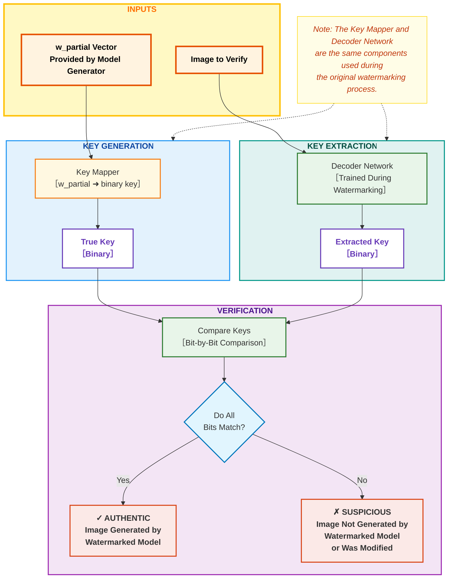

# StyleGAN Watermarking Verification Pipeline

## Description

This diagram illustrates the verification pipeline for authenticating images generated by a watermarked StyleGAN2 model:

1. **Inputs**
   - The image to be verified (potentially generated by a watermarked model)
   - The w_partial vector provided by the model generator alongside the image

2. **Key Generation**
   - The Key Mapper generates the true binary key from w_partial
   - This is the same Key Mapper used during the watermarking process

3. **Key Extraction**
   - The trained Decoder Network extracts a binary key from the image
   - This Decoder was trained during the watermarking process

4. **Verification**
   - The two keys are compared bit by bit
   - If all bits match, the image is deemed authentic (generated by the watermarked model)
   - If any bits don't match, the image is flagged as suspicious (potentially modified or generated by a different model)

## Use Cases

1. **Content Authenticity Verification**
   - Verify that an image was generated by a specific watermarked model
   - Detect images that have been tampered with or generated by unauthorized models

2. **Copyright Protection**
   - Provide evidence that an image was generated by a specific model
   - Help in tracking the provenance of AI-generated content

3. **Model Attribution**
   - Enable model creators to prove ownership of generated content
   - Allow users to verify the source of AI-generated images 