# w_partial Extraction Process

```mermaid
flowchart LR
    classDef original fill:#f3e5f5,stroke:#7b1fa2
    classDef selected fill:#e8f5e9,stroke:#2e7d32,stroke-width:2px
    
    subgraph w[w Latent Vector &#40;512 elements&#41;]
        w0[0]:::original
        w1[1]:::original
        w2[2]:::selected
        w3["..."]:::original
        w31[31]:::selected
        w32[32]:::original
        w33["..."]:::original
        w127[127]:::selected
        w128[128]:::original
        w129["..."]:::original
        w511[511]:::original
    end
    
    w2 --> select[Selected Indices]
    w31 --> select
    w127 --> select
    
    subgraph wp[w_partial &#40;32 elements&#41;]
        wp0[Index 2]:::selected
        wp1[Index 31]:::selected
        wp2["..."]:::selected
        wp31[Index 127]:::selected
    end
    
    select --> wp
    
    note[The config uses a list of<br>32 specific indices from<br>the full w vector]
    
    note -.-> select
```

## Description

This diagram illustrates how the w_partial vector is extracted from the full w latent vector:

1. **Input Vector**
   - Full w latent vector with 512 elements
   - Each element is a floating-point number

2. **Selection Process**
   - Uses a predefined list of 32 specific indices
   - These indices are configured in the training setup
   - Example indices shown: 2, 31, 127, etc.

3. **Output Vector**
   - w_partial vector containing 32 elements
   - Each element corresponds to a selected index from the original w vector
   - Maintains the same order as the selected indices

4. **Configuration**
   - The selection of indices is fixed during training
   - This ensures consistent watermarking across all generated images 